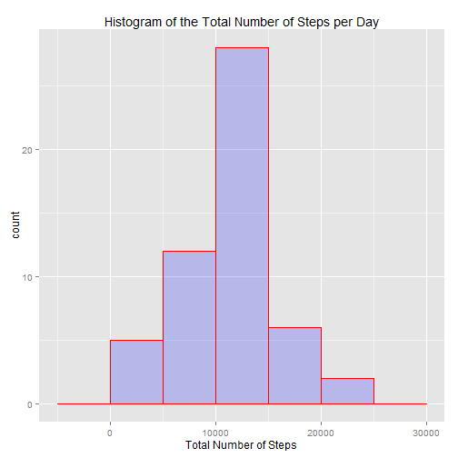
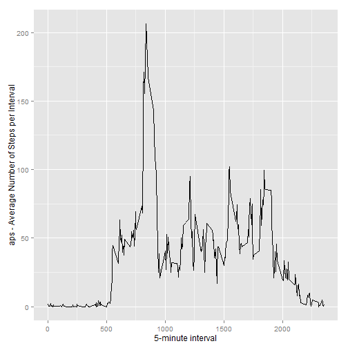
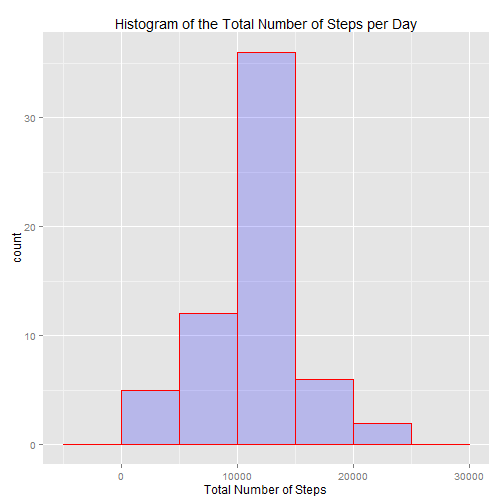
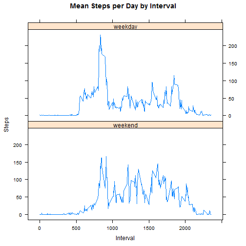

Introduction
------------

It is now possible to collect a large amount of data about personal movement using activity monitoring devices such as a Fitbit, Nike Fuelband, or Jawbone Up. These type of devices are part of the "quantified self" movement - a group of enthusiasts who take measurements about themselves regularly to improve their health, to find patterns in their behavior, or because they are tech geeks. But these data remain under-utilized both because the raw data are hard to obtain and there is a lack of statistical methods and software for processing and interpreting the data.

This assignment makes use of data from a personal activity monitoring device. This device collects data at 5 minute intervals through out the day. The data consists of two months of data from an anonymous individual collected during the months of October and November, 2012 and include the number of steps taken in 5 minute intervals each day.

Data
----

The data for this assignment can be downloaded from the course web site:

Dataset: Activity monitoring data [52K] - https://d396qusza40orc.cloudfront.net/repdata%2Fdata%2Factivity.zip

The variables included in this dataset are:

steps: Number of steps taking in a 5-minute interval (missing values are coded as NA)

date: The date on which the measurement was taken in YYYY-MM-DD format

interval: Identifier for the 5-minute interval in which measurement was taken

The dataset is stored in a comma-separated-value (CSV) file and there are a total of 17,568 observations in this dataset.


Loading and preprocessing the data
-----------------------------------

```r
temp <- tempfile()
download.file("http://d396qusza40orc.cloudfront.net/repdata%2Fdata%2Factivity.zip",temp)
con <- unz(temp, "activity.csv")
dat <- read.csv(con)
unlink(temp)
```

Calculating the mean total number of steps taken per day
--------------------------------------------------------

1.Calculating the total number of steps taken per day

```r
library(ggplot2)
tpd <- tapply(dat$steps, dat$date,sum)
```
2.Genrating a histogram of the total number of steps taken each day

```r
qplot(tpd 
      ,geom="histogram"
      ,binwidth = 5000
      ,main = "Histogram of the Total Number of Steps per Day"
      ,xlab="Total Number of Steps"
      ,fill = I("blue")
      ,col = I("red")
      ,alpha = I(.2)
      ,xlimit = c(0,23000)
      )
```

 
3.Calculating and reporting the mean and median of the total number of steps taken per day

```r
mean(tpd, na.rm=TRUE)
```

```
## [1] 10766.19
```

```r
median(tpd, na.rm=TRUE)
```

```
## [1] 10765
```

Calculating and plotting the average daily activity pattern

```r
aps <- tapply(dat$steps, dat$interval, mean, na.rm=TRUE)
aps <- as.data.frame(as.table(aps))
names(aps) <- c("interval", "aps")
aps$interval <- as.numeric(as.character(aps$interval))
ggplot(data=aps, aes(x=interval, y=aps)) +
        geom_line() +
        xlab("5-minute interval") +
        ylab("aps - Average Number of Steps per Interval")
```

 
Finding the 5-minute interval, on average across all the days in the dataset, contains the maximum number of steps

```r
aps[which.max(aps$aps),1]
```

```
## [1] 835
```

Imputing missing values
=======================
Total Number of Missing Values in the Dataset

```r
sum(is.na(dat))
```

```
## [1] 2304
```
Creating a new Dataset with imputation based on the mean steps per interval and generating a histogram of the total number of steps taken each day. Eventually recoputing the mean and media

```r
byinterval <- aggregate(steps ~ interval,dat, mean)
imputation <- transform(dat, steps = ifelse(is.na(dat$steps), byinterval$steps[match(dat$interval, byinterval$interval)], dat$steps))
tpdimput <- tapply(imputation$steps, imputation$date,sum)
qplot(tpdimput 
      ,geom="histogram"
      ,binwidth = 5000
      ,main = "Histogram of the Total Number of Steps per Day"
      ,xlab="Total Number of Steps"
      ,fill = I("blue")
      ,col = I("red")
      ,alpha = I(.2)
      ,xlimit = c(0,23000))
```

 

```r
mean(tpdimput)
```

```
## [1] 10766.19
```

```r
median(tpdimput)
```

```
## [1] 10766.19
```
Difference between mean and median for the original dataset and the one including imputation:
Delta Mean followed  by delta median

```r
mean(tpdimput)-mean(tpd,na.rm=TRUE)
```

```
## [1] 0
```

```r
median(tpdimput)-median(tpd, na.rm=TRUE)
```

```
## [1] 1.188679
```
As observed and expected, the mean did not change as we used the mean steps by interval algorythm, however the median did change.


Understanding if there are differences in activity patterns between weekdays and weekends

```r
imputation$date <- as.Date(imputation$date)
wday <- c("Monday", "Tuesday", "Wednesday", "Thursday","Friday")
imputation$wdays <- factor((weekdays(imputation$date) %in% wday), levels=c(FALSE, TRUE), labels=c('weekend', 'weekday'))
library(lattice)
stepsint <- aggregate(steps ~ interval + wdays, imputation, mean)
xyplot(stepsint$steps ~ stepsint$interval|stepsint$wdays, main="Mean Steps per Day by Interval",xlab="Interval", ylab="Steps",layout=(c(1,2)), type="l")
```

 
